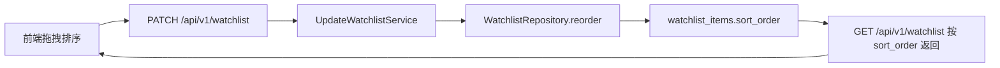
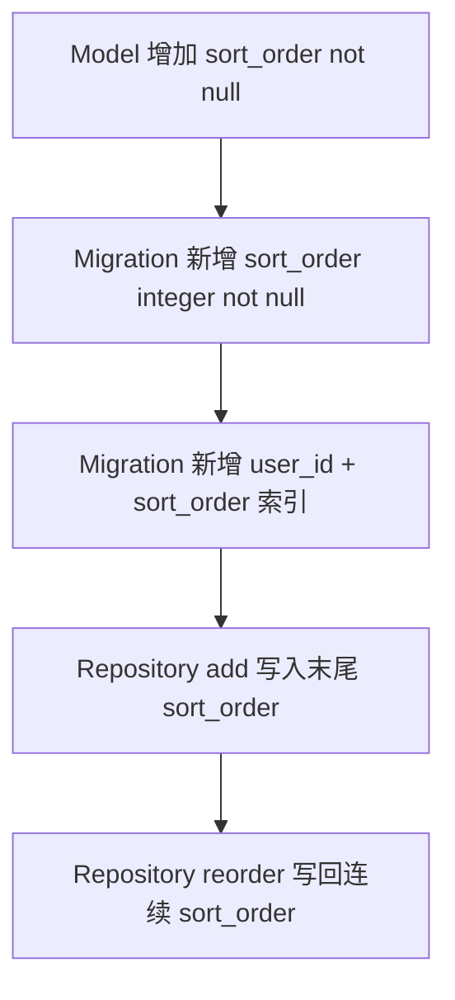
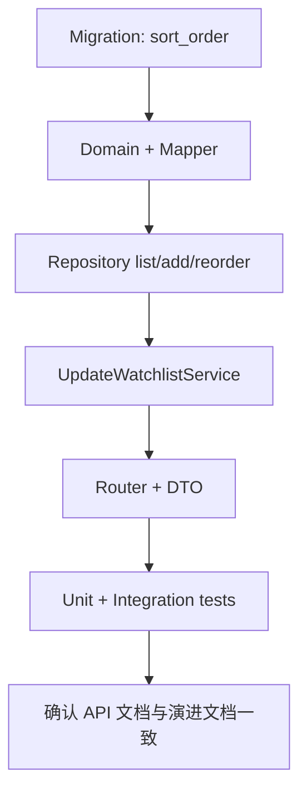
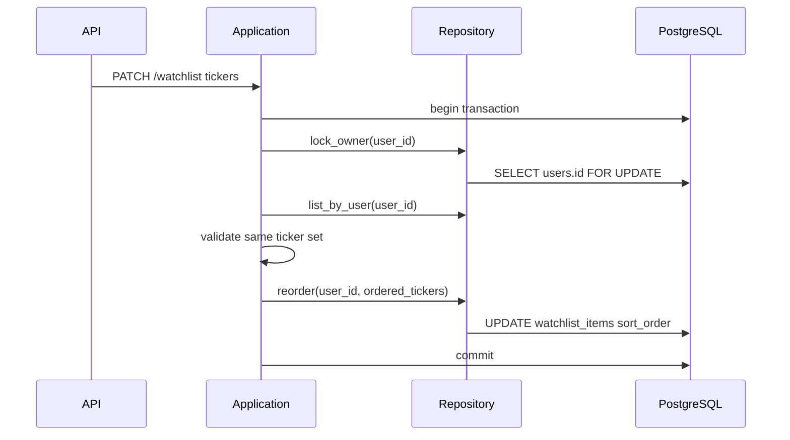

# BE-0004 — Watchlist Ordering Backend Evolution

> 状态：Completed  
> 关联 PRD：`docs/prd/PRD-0001-market-watch.md`  
> 关联前端演进：`docs/frontend-evolution/FE-0001-market-watch-terminal-design.md`  
> 前置阶段：`docs/backend-evolution/BE-0001-auth-watchlist.md`

## 1. 概览

本阶段补齐前端 watchlist ticker 拖曳排序所需的后端能力：当前用户的默认 watchlist 需要有服务端持久化顺序，并提供一个更新默认 watchlist 顺序的 API。

BE-0001 已完成用户级默认 watchlist 的增删查，但排序语义仍是“按创建时间返回”。FE-0001 已将“单 watchlist 拖拽排序”列为 P1，并明确依赖后端排序持久化接口。本阶段只演进单个默认 watchlist，不引入多 watchlist、分组、共享或列表命名。



## 2. 目标

- 为 `watchlist_items` 增加用户内排序字段。
- `GET /api/v1/watchlist` 改为按用户自定义顺序返回。
- 新增 update watchlist API，用于提交当前默认 watchlist 的完整 ticker 顺序。
- 保持现有 add/delete API 可用，并定义它们与排序字段的关系。
- 保持 watchlist 仍与当前登录用户绑定，不能跨用户读写。
- 保持 DDD 分层：API 薄、Application 编排、Infrastructure 负责 SQL、Domain 不引入框架或数据库细节。

## 3. 非目标

- 不新增 `watchlists` 表。
- 不支持多个 watchlist。
- 不支持 watchlist 重命名、描述、共享、分组或标签。
- 不把 `PATCH /watchlist` 设计成 add/delete 的批量替代接口。
- 不改变 market-data snapshots/bars 的查询语义；它们仍消费 ticker 集合，不关心用户排序。

## 4. 当前状态

### 4.1 已有能力

| 能力 | 当前行为 |
| --- | --- |
| 查询 | `GET /api/v1/watchlist` 返回当前用户 items |
| 添加 | `POST /api/v1/watchlist/items` 添加 ticker，统一大写、去重、校验 Massive 支持 |
| 删除 | `DELETE /api/v1/watchlist/items/{ticker}` 删除当前用户 ticker |
| 排序 | 按 `created_at ASC, id ASC` 返回 |
| 存储 | `watchlist_items(id, user_id, ticker, created_at)` |

### 4.2 需要演进的问题

- 创建顺序不能表达用户拖拽后的意图。
- 前端刷新页面后无法恢复拖拽顺序。
- 仅靠客户端 localStorage 会造成跨设备、跨浏览器不一致，不符合“watchlist items 是服务端状态”的现有前端设计。

## 5. 方案对比

| 方案 | API 形态 | 优点 | 风险 | 结论 |
| --- | --- | --- | --- | --- |
| A. 完整有序 ticker 数组 | `PATCH /api/v1/watchlist` + `{ "tickers": [...] }` | 语义直接；一次请求表达最终顺序；后端容易校验集合一致 | 请求必须带全量列表，但上限只有 50 | 推荐 |
| B. 单 item 移动 | `PATCH /api/v1/watchlist/items/{ticker}/position` | 请求体小；适合很大列表 | 需要处理移动算法、并发中间态和多次拖拽覆盖 | 暂不需要 |
| C. 批量替换 watchlist | `PUT /api/v1/watchlist` + 完整 items | 可同时表达 add/delete/reorder | 会混淆 reorder 与 membership mutation，绕开已有 add/delete 校验 | 不推荐 |

推荐采用方案 A：提交完整有序 ticker 数组。它最贴合前端拖拽结束后的“最终顺序”模型，也能让后端明确拒绝隐式新增或删除。

## 6. 目标行为

### 6.1 排序口径

- 每个 `watchlist_items` 行新增 `sort_order`。
- `sort_order` 只在同一 `user_id` 下有意义。
- 排序从 `0` 开始，连续递增。
- 查询顺序：`sort_order ASC, created_at ASC, id ASC`。
- 当前数据库没有需要保留的 watchlist 数据，migration 直接新增 `sort_order NOT NULL`；如果后续环境已经产生历史数据，再单独补 backfill migration。

### 6.2 添加 ticker 的排序规则

`POST /api/v1/watchlist/items` 成功添加新 ticker 时：

- 新 item 自动追加到当前用户 watchlist 末尾。
- 新 item 的 `sort_order = 当前用户最大 sort_order + 1`。
- 添加仍需要在用户级锁内完成，避免并发添加得到相同位置。

### 6.3 删除 ticker 的排序规则

`DELETE /api/v1/watchlist/items/{ticker}` 成功删除后：

- 可以接受短期留下排序空洞，因为查询按 `sort_order` 仍稳定。
- 推荐在同一事务内压缩当前用户剩余 items 的 `sort_order` 为 `0..n-1`，让数据保持规范。
- 若实现成本较高，第一版可不压缩，但 `PATCH /api/v1/watchlist` 成功后必须写回连续顺序。

### 6.4 拖拽排序规则

前端拖拽结束后提交完整 ticker 顺序。后端只接受当前用户已有 ticker 的重排，不隐式新增或删除 ticker。

校验规则：

- 请求中的 ticker 统一 trim + upper。
- ticker 数量必须等于当前用户 watchlist item 数量。
- 请求 ticker 不允许重复。
- 请求 ticker 集合必须与当前用户已有 ticker 集合完全一致。
- 空 watchlist 不需要调用更新接口；如果调用且 body 为空数组，可以返回当前空列表。

## 7. API 设计

### 7.1 `GET /api/v1/watchlist`

用途不变：返回当前用户默认 watchlist。

行为变化：

- 返回顺序改为服务端持久化顺序。
- response item 增加 `position`，便于前端调试、测试和 optimistic update 对齐。

成功响应：`200 OK`

```json
{
  "items": [
    {
      "ticker": "NVDA",
      "position": 0,
      "created_at": "2026-03-13T10:02:00Z"
    },
    {
      "ticker": "AAPL",
      "position": 1,
      "created_at": "2026-03-13T10:00:00Z"
    }
  ]
}
```

### 7.2 `PATCH /api/v1/watchlist`

用途：

- 更新当前用户默认 watchlist 的 ticker 顺序。
- 当前阶段只表达 reorder，不表达新增、删除或多列表属性更新。

请求体：

```json
{
  "tickers": ["NVDA", "AAPL", "MSFT"]
}
```

处理规则：

1. API 层只做 DTO 校验和鉴权。
2. Application 层标准化 ticker、打开 UoW、锁定当前用户 watchlist mutation。
3. Repository 读取当前用户 items。
4. Application 校验请求 ticker 集合与当前 items 完全一致。
5. Repository 批量写入 `sort_order = tickers 数组下标`。
6. 返回更新后的 `WatchlistResponse`。

成功响应：`200 OK`

```json
{
  "items": [
    {
      "ticker": "NVDA",
      "position": 0,
      "created_at": "2026-03-13T10:02:00Z"
    },
    {
      "ticker": "AAPL",
      "position": 1,
      "created_at": "2026-03-13T10:00:00Z"
    },
    {
      "ticker": "MSFT",
      "position": 2,
      "created_at": "2026-03-13T10:03:00Z"
    }
  ]
}
```

错误：

| HTTP | code | 场景 |
| --- | --- | --- |
| 400 | `VALIDATION_ERROR` | body 结构错误或 `tickers` 不是数组 |
| 401 | `AUTH_REQUIRED` | 未登录 |
| 401 | `AUTH_TOKEN_INVALID` | token 非法 |
| 401 | `AUTH_TOKEN_EXPIRED` | token 过期 |
| 422 | `WATCHLIST_ORDER_INVALID` | ticker 重复、格式非法、数量不匹配、集合不一致 |

说明：

- 集合不一致使用 `WATCHLIST_ORDER_INVALID`，避免前端误以为 reorder API 可以新增或删除 item。
- 不调用 Massive ticker existence 校验，因为 reorder 只允许重排已存在 ticker。

## 8. 数据模型

### 8.1 表结构变化

`watchlist_items` 新增字段：

```text
sort_order integer not null
```

推荐索引：

```text
ix_watchlist_items_user_sort_order(user_id, sort_order)
```

保留现有约束：

```text
uq_watchlist_items_user_ticker(user_id, ticker)
ix_watchlist_items_user_id(user_id)
```

第一版不新增 `(user_id, sort_order)` 唯一约束。排序一致性由用户级 mutation 锁和 application 校验保证，避免 reorder 批量更新时引入非 deferrable unique constraint 的临时冲突。后续如确实需要数据库级唯一性，可使用 PostgreSQL deferrable unique constraint 单独演进。

### 8.2 迁移策略

当前数据库没有需要保留的 watchlist 数据，因此 migration 可以直接新增 `sort_order integer not null`，不需要先 nullable、回填、再改为 not null。



推荐 migration 方向：

```sql
ALTER TABLE watchlist_items
ADD COLUMN sort_order integer NOT NULL;

CREATE INDEX ix_watchlist_items_user_sort_order
ON watchlist_items (user_id, sort_order);
```

如果后续环境已经产生数据，再单独补充 backfill migration；当前阶段不为不存在的历史数据增加复杂度。

## 9. DDD 分层落点

| 层 | 变更 |
| --- | --- |
| Domain | `WatchlistItem` 增加 `position: int`，保持 dataclass 纯净 |
| API schema | `WatchlistItemResponse` 增加 `position`；新增 `UpdateWatchlistRequest` |
| API router | 新增 `PATCH /api/v1/watchlist` |
| Application | 新增 `UpdateWatchlistService` |
| Infrastructure model | `WatchlistItemModel` 增加 `sort_order` |
| Mapper | ORM `sort_order` 映射为 domain `position` |
| Repository | `list_by_user` 按 `sort_order` 排序；新增 reorder 批量更新方法 |
| Migration | 新增 Alembic migration 回填并约束 `sort_order` |

执行顺序：



## 10. 并发与一致性

### 10.1 用户级锁

沿用现有 `lock_owner(user_id)` 思路，在 add/delete/reorder 这类 mutation 中锁定当前用户行：



### 10.2 冲突行为

如果前端基于旧列表提交排序，同时另一请求已经 add/delete：

- 后端会发现请求 ticker 集合与当前 DB 集合不一致。
- 返回 `422 WATCHLIST_ORDER_INVALID`。
- 前端应重新拉取 `GET /api/v1/watchlist`，以服务端状态为准。

第一版不引入 `version` 或 `updated_at` 乐观锁。当前单用户 watchlist 最大 50 个 item，集合校验已经足够发现拖拽排序与 add/delete 的主要冲突。

## 11. 测试设计

### 11.1 Application 单元测试

- `UpdateWatchlistService` 能按请求顺序返回 items。
- 小写 ticker 请求会标准化为大写。
- 请求 ticker 重复时返回 `WATCHLIST_ORDER_INVALID`。
- 请求缺少现有 ticker 时返回 `WATCHLIST_ORDER_INVALID`。
- 请求包含当前用户不存在 ticker 时返回 `WATCHLIST_ORDER_INVALID`。
- 空 watchlist + 空数组请求返回空列表。

### 11.2 Repository / Persistence 测试

- empty-schema migration 可直接新增 `sort_order NOT NULL` 并建立索引。
- `list_by_user` 按 `sort_order ASC` 返回。
- add item 会追加到最大 `sort_order + 1`。
- reorder 后同一用户 items 的 `sort_order` 连续且只影响当前用户。
- 不同用户拥有同一 ticker 时，reorder 互不影响。

### 11.3 API 集成测试

- 未登录调用 `PATCH /api/v1/watchlist` 返回 `401`。
- 登录用户可提交完整 ticker 顺序并得到新顺序。
- `GET /api/v1/watchlist` 在 reorder 后返回持久化顺序。
- 请求 ticker 集合不一致时返回 `422 WATCHLIST_ORDER_INVALID`。
- 用户 A 不能通过 reorder 影响用户 B 的 watchlist。

## 12. 交付定义

本阶段完成后，应满足：

- `watchlist_items` 有可持久化的用户内排序字段。
- `GET /api/v1/watchlist` 返回服务端排序，并包含 `position`。
- `PATCH /api/v1/watchlist` 支持完整 ticker 顺序更新。
- add/delete/reorder 在用户级 mutation 锁下保持一致性。
- 自动化测试覆盖 service、repository、API 的核心排序场景。
- FE-0001 的 P1 “单 watchlist 拖拽排序” 可以直接基于该 API 实现。

## 13. 开放问题

当前建议：

- 第一版不引入 `watchlists` 表。
- 第一版不引入 watchlist `version` 字段。
- 第一版不让 `PATCH /api/v1/watchlist` 承担批量 add/delete。

后续如果前端需要更强并发体验，可以新增：

- `watchlist_revision` 或 `updated_at`，让前端提交基于哪个版本排序。
- `409 WATCHLIST_VERSION_CONFLICT`，用于区别“请求格式不合法”和“基于旧版本提交”。
