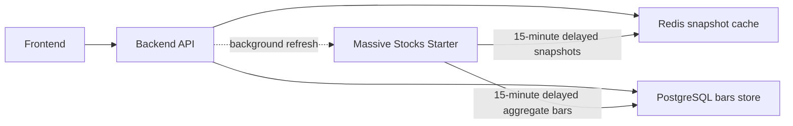

# Massive Stocks API Reference

Last verified: 2026-06-02

## Overview

This document is the stock data integration reference for this repository after
the account downgrade to **Massive Stocks Starter ($29/mo)**.

The practical backend stance is:

- Treat Stocks Starter market data as **15-minute delayed**.
- Keep REST snapshots and aggregate bars as the MVP data foundation.
- Do not build against REST/WS trades or REST/WS quotes while the project runs on
  Stocks Starter.
- Keep plan capability resolution centralized in backend configuration and expose
  the resolved capabilities to frontend.

## Source Policy

This document is based on:

- Massive official documentation.
- Massive official pricing and plan labels shown in the interactive docs.
- The official Python package version imported by the legacy project.

This document is not limited by the legacy application's actual call paths.
Legacy is used here only for SDK baseline and compatibility context:

- package name: `massive`
- locked version in legacy: `2.2.0`
- legacy dependency files:
  - `/Users/mz/pmf/trader-helper/backend/pyproject.toml`
  - `/Users/mz/pmf/trader-helper/backend/poetry.lock`

## Official Sources

- REST stocks overview: [Massive REST stocks docs](https://massive.com/docs/rest/stocks/overview)
- WebSocket stocks overview: [Massive WebSocket stocks docs](https://massive.com/docs/websocket/stocks/overview?assetClass=stocks&license=personal&name=stocks_starter)
- Pricing: [Massive Stocks pricing](https://massive.com/pricing?product=stocks)

Key endpoint docs referenced while writing this file:

- [Stocks Custom Bars](https://massive.com/docs/rest/stocks/aggregates/custom-bars)
- [Stocks Full Market Snapshot](https://massive.com/docs/rest/stocks/snapshots/full-market-snapshot)
- [Stocks Single Ticker Snapshot](https://massive.com/docs/rest/stocks/snapshots/single-ticker-snapshot)
- [Stocks Last Quote](https://massive.com/docs/rest/stocks/trades-quotes/last-quote)
- [Stocks Last Trade](https://massive.com/docs/rest/stocks/trades-quotes/last-trade)
- [Stocks Quotes](https://massive.com/docs/rest/stocks/trades-quotes/quotes)
- [Stocks Trades](https://massive.com/docs/rest/stocks/trades-quotes/trades)
- [WS Aggregates Per Minute](https://massive.com/docs/websocket/stocks/aggregates-per-minute)
- [WS Aggregates Per Second](https://massive.com/docs/websocket/stocks/aggregates-per-second)
- [WS Quotes](https://massive.com/docs/websocket/stocks/quotes)
- [WS Trades](https://massive.com/docs/websocket/stocks/trades)

## Plan Scope

The current target plan is:

- `starter`

Upgrade comparison plans kept in this document only for implementation gating:

- `developer`
- `advanced`

Everything else is out of scope unless a future task explicitly adds an
entitlement or add-on.

## Recommended Environment Variables

Project conventions:

- `MASSIVE_API_KEY`
- `MASSIVE_STOCK_PLAN=starter|developer|advanced`
- `MARKET_DATA_DELAY_MINUTES=15` for `starter` and `developer`
- `MARKET_DATA_SUPPORTS_STREAM=true|false`

Recommended derived flags:

- `massive_has_realtime`
- `massive_has_snapshots`
- `massive_has_rest_quotes`
- `massive_has_rest_trades`
- `massive_has_rest_last_quote`
- `massive_has_rest_last_trade`
- `massive_has_rest_aggregate_bars`
- `massive_has_ws_quotes`
- `massive_has_ws_trades`
- `massive_has_ws_minute_aggs`
- `massive_has_ws_second_aggs`

Recommended defaults:

| Plan | latency | snapshots | aggregate bars | REST trades | REST quotes | WS minute aggs | WS second aggs | WS trades | WS quotes |
| --- | --- | --- | --- | --- | --- | --- | --- | --- | --- |
| starter | 15-minute delayed | yes | yes, 5-year history | no | no | yes | yes | no | no |
| developer | 15-minute delayed | yes | yes, 10-year history | yes | no | yes | yes | yes | no |
| advanced | real-time | yes | yes, all history | yes | yes | yes | yes | yes | yes |

Basis:

- Custom Bars docs show Starter as 15-minute delayed with 5 years of history.
- Snapshot docs show Starter as 15-minute delayed.
- REST trades and last trade docs show Starter as not included.
- REST quotes and last quote docs show Starter as not included.
- WebSocket aggregate docs show Starter as 15-minute delayed.
- WebSocket trades and quotes docs show Starter as not included.

## Starter Permission Summary

### Clearly Included On Starter

- REST aggregate bars:
  - `GET /v2/aggs/ticker/{stocksTicker}/range/{multiplier}/{timespan}/{from}/{to}`
  - 15-minute delayed
  - 5 years of history
- REST snapshots:
  - `GET /v2/snapshot/locale/us/markets/stocks/tickers`
  - `GET /v2/snapshot/locale/us/markets/stocks/tickers/{stocksTicker}`
  - 15-minute delayed
- REST reference-data style endpoints listed as included in all Stocks plans:
  - tickers
  - ticker overview
  - ticker types
  - exchanges
  - condition codes
  - market status
  - market holidays
- REST corporate actions and technical indicators that official docs list as
  included in all Stocks plans.
- WebSocket aggregate feeds:
  - `WS /stocks/AM`
  - `WS /stocks/A`
  - 15-minute delayed

### Not Included On Starter

- REST trades:
  - `GET /v3/trades/{stockTicker}`
- REST last trade:
  - `GET /v2/last/trade/{stocksTicker}`
- REST quotes:
  - `GET /v3/quotes/{stockTicker}`
- REST last quote:
  - `GET /v2/last/nbbo/{stocksTicker}`
- WebSocket trades:
  - `WS /stocks/T`
- WebSocket quotes:
  - `WS /stocks/Q`
- Real-time stock feed.

### Requires Separate Verification Or Separate Entitlement

- WebSocket FMV:
  - official docs describe it as Business plan only.
- WebSocket NOI:
  - likely separate entitlement based on the NYSE order imbalance product.
- WebSocket LULD:
  - public docs exist, but entitlement should be verified before use.
- Financials and ratios:
  - official docs show a separate Financials & Ratios Expansion alongside stock
    plans in several places.
- Filings and news:
  - official docs exist, but this repository should verify current access before
    depending on them.

## Stocks REST Catalog

The list below follows the official Massive REST stocks catalog. The
`Starter permission` column is intentionally conservative.

| Group | Endpoint / Doc | Starter permission | Notes |
| --- | --- | --- | --- |
| Aggregates | Custom Bars | Included | 15-minute delayed; 5-year history |
| Aggregates | Daily Market Summary | Included | official docs list all Stocks plans |
| Aggregates | Daily Ticker Summary | Included | official docs list all Stocks plans |
| Aggregates | Previous Day Bar | Included | official docs list all Stocks plans |
| Corporate Actions | Dividends | Included | official docs list all Stocks plans |
| Corporate Actions | IPOs | Included | official docs list all Stocks plans |
| Corporate Actions | Splits | Included | official docs list all Stocks plans |
| Corporate Actions | Ticker Events | Included | official docs list all Stocks plans; experimental |
| Filings | 10-K / 8-K / 13-F / Risk Factors | Verify | docs currently show broad access, but verify before implementation |
| Fundamentals | Balance Sheets / Cash Flow / Income / Ratios | Verify | may require Financials & Ratios Expansion |
| Fundamentals | Float / Short Interest / Short Volume | Verify | verify before product dependency |
| Market Operations | Condition Codes | Included | reference-data style endpoint |
| Market Operations | Exchanges | Included | reference-data style endpoint |
| Market Operations | Market Holidays | Included | reference-data style endpoint |
| Market Operations | Market Status | Included | reference-data style endpoint |
| News | News | Verify | verify before implementation |
| Snapshots | Full Market Snapshot | Included | 15-minute delayed |
| Snapshots | Single Ticker Snapshot | Included | 15-minute delayed |
| Snapshots | Top Market Movers | Included | snapshot family endpoint |
| Snapshots | Unified Snapshot | Verify | multi-asset endpoint; verify stock-only use |
| Technical Indicators | EMA / MACD / RSI / SMA | Included | official docs list all Stocks plans |
| Tickers | All Tickers | Included | reference-data style endpoint |
| Tickers | Related Tickers | Included | official docs list all Stocks plans |
| Tickers | Ticker Overview | Included | reference-data style endpoint |
| Tickers | Ticker Types | Included | reference-data style endpoint |
| Trades/Quotes | Last Quote | Not included | Advanced only in current docs |
| Trades/Quotes | Last Trade | Not included | Developer+ in current docs |
| Trades/Quotes | Quotes | Not included | Advanced only in current docs |
| Trades/Quotes | Trades | Not included | Developer+ in current docs |

## REST Endpoints Most Likely To Matter First

### Starter-Safe Market Data Core

- `GET /v2/aggs/ticker/{stocksTicker}/range/{multiplier}/{timespan}/{from}/{to}`
- `GET /v2/snapshot/locale/us/markets/stocks/tickers`
- `GET /v2/snapshot/locale/us/markets/stocks/tickers/{stocksTicker}`

Implementation implications:

- The backend can continue using snapshots + aggregate bars for MVP.
- The backend must not require `lastTrade` to compute a usable snapshot.
- `delay_minutes` must be `15`.
- `is_realtime` must be `false`.

### Not Starter-Safe

- `GET /v2/last/trade/{stocksTicker}`
- `GET /v3/trades/{stockTicker}`
- `GET /v2/last/nbbo/{stocksTicker}`
- `GET /v3/quotes/{stockTicker}`

Implementation implications:

- Do not call these endpoints unless `MASSIVE_STOCK_PLAN` is upgraded and the
  backend capability resolver says they are available.
- Do not make snapshot mapping depend on nested trade or quote sections.

### Market Calendar And State

- `GET /v1/marketstatus/now`
- `GET /v1/marketstatus/upcoming`

### Reference Data For Ticker Lookup

- `GET /v3/reference/tickers`
  - supports exact ticker lookup
  - supports `search` against ticker and/or company name
  - should set `market=stocks`
  - should prefer `active=true` for MVP watchlist flows
  - should be normalized in backend instead of exposed directly to frontend

## Stocks WebSocket Catalog

Official stocks WebSocket feeds currently listed in the public docs:

| Feed | Endpoint | Starter permission | Notes |
| --- | --- | --- | --- |
| Aggregates Per Minute | `WS /stocks/AM` | Included | 15-minute delayed |
| Aggregates Per Second | `WS /stocks/A` | Included | 15-minute delayed |
| Fair Market Value | `WS /business/stocks/FMV` | Verify | official docs describe Business plan access |
| Net Order Imbalance | `WS /stocks/NOI` | Verify | likely separate entitlement |
| Limit Up - Limit Down | `WS /stocks/LULD` | Verify | verify before use |
| Quotes | `WS /stocks/Q` | Not included | Advanced only in current docs |
| Trades | `WS /stocks/T` | Not included | Developer+ in current docs |

## WebSocket Feeds Most Likely To Matter First

### Starter-Safe

- `WS /stocks/A`
- `WS /stocks/AM`

### Not Starter-Safe

- `WS /stocks/T`
- `WS /stocks/Q`

Project guidance:

- Keep `MARKET_DATA_SUPPORTS_STREAM=false` unless backend explicitly implements
  delayed aggregate fanout from `WS /stocks/A` or `WS /stocks/AM`.
- Frontend must not assume a trade or quote event stream exists on Starter.

## Snapshot Field-Level Plan Behavior

The snapshot docs explicitly state that nested `lastTrade` and `lastQuote`
sections are returned only if the current plan includes those capabilities.

### Full Market Snapshot

- Endpoint: `GET /v2/snapshot/locale/us/markets/stocks/tickers`

Field behavior:

- `tickers[].lastTrade` appears only if the current plan includes trades.
- `tickers[].lastQuote` appears only if the current plan includes quotes.
- `tickers[].fmv` is Business-plan oriented and must be treated as optional.

Project implication on Starter:

- `lastTrade` must be treated as optional and usually absent.
- `lastQuote` must be treated as optional and usually absent.
- Snapshot price should prefer provider-level `last` or aggregate fields such as
  `min.c` / `day.c` when trade fields are absent.
- `last_trade_at` can be `null`; session and staleness logic must tolerate it.

### Single Ticker Snapshot

- Endpoint: `GET /v2/snapshot/locale/us/markets/stocks/tickers/{stocksTicker}`

Field behavior:

- `ticker.lastTrade` appears only if the current plan includes trades.
- `ticker.lastQuote` appears only if the current plan includes quotes.

Project implication on Starter:

- Treat all trade and quote sections as optional.
- Do not use missing trade/quote sections as a reason to mark the entire snapshot
  unresolved if aggregate/day fields are sufficient.

## Current Repository Impact

### Backend Features Expected To Continue Working On Starter

- Ticker search and watchlist ticker validation via `GET /v3/reference/tickers`.
- Snapshot polling based on the full-market snapshot endpoint, provided the
  mapper tolerates missing `lastTrade`.
- Historical and current-day bars ingestion via custom aggregate bars, with
  15-minute delayed data and 5-year history limits.
- Frontend-facing capability response for `delay_minutes=15` and
  `is_realtime=false`.

### Backend Features At Risk On Starter

| Priority | Area | Risk | Required change |
| --- | --- | --- | --- |
| P1 | Snapshot mapping | Current code already falls back from missing `lastTrade` to `last`, `min.c`, then `day.c`, but there is no Starter-specific no-`lastTrade` regression test. It also still requires complete day/change fields. | Add a Starter fixture with no `lastTrade` / no `lastQuote`; verify early-session nullability against the live account. |
| P1 | Capability modeling | Current backend exposes only `delay_minutes`, `is_realtime`, and `supports_stream`; it does not expose quote/trade capability flags. | Add explicit `has_trades`, `has_quotes`, and aggregate-stream flags before frontend depends on them. |
| P1 | Settings | `massive_stock_plan` defaults to `developer` but capability behavior is driven by `market_data_delay_minutes`. | Align defaults/documentation to `starter`, or add a resolver from plan to capabilities. |
| P1 | Bars retention | Starter aggregate bars history is 5 years, but current backend retention constants keep 10 years of `1d` bars. | Clamp bootstrap/reconciliation windows to 5 years when `starter`. |
| P2 | Future streaming | Starter supports delayed aggregate WS feeds but not trade/quote WS feeds. | Keep stream disabled until backend implements aggregate-only delayed fanout. |
| P2 | Docs and PRD wording | Existing PRD says MVP uses Developer/Advanced shared capability. | Update wording if Starter becomes the project baseline. |

## SDK Baseline

The official Python package baseline imported by the legacy project is:

- package: `massive`
- version: `2.2.0`

Project guidance:

- use this as the first compatibility target when building the integration layer
- do not assume this repository must preserve the legacy wrapper API
- prefer backend-owned adapters that map official HTTP/WebSocket docs into this
  repository's domain model

## Implementation Rules For This Repository

- Gate every trade-dependent feature behind `massive_has_rest_trades` or
  `massive_has_ws_trades`.
- Gate every quote-dependent feature behind `massive_has_rest_quotes` or
  `massive_has_ws_quotes`.
- Allow snapshot and aggregate-bar features on `starter`, `developer`, and
  `advanced`.
- Treat `starter` and `developer` as delayed modes.
- Treat `advanced` as real-time capable.
- Keep plan capability resolution centralized in backend configuration.
- Expose resolved capabilities to frontend rather than recomputing them in
  multiple places.
- Do not make undocumented assumptions about FMV, NOI, LULD, filings, financials,
  ratios, or news entitlements.

## Open Verification Items

- Whether the live account can access all "included in all Stocks plans" filing
  endpoints without an expansion add-on.
- Whether financials and ratios require the separate Financials & Ratios
  Expansion for this account.
- Whether `LULD` is bundled in Starter, Advanced, or a separate entitlement.
- Current WebSocket auth and subscription payload shape in the live platform docs.
- Whether the `massive` Python SDK exposes all required stock surfaces directly,
  or whether some endpoints should be called over raw HTTP instead of SDK
  convenience methods.
