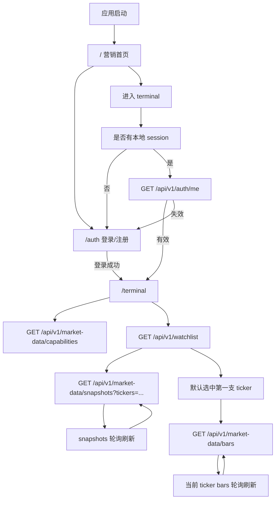
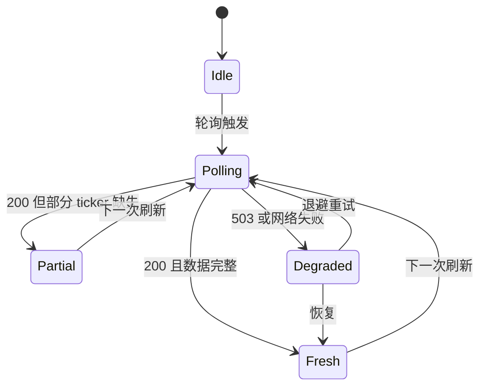
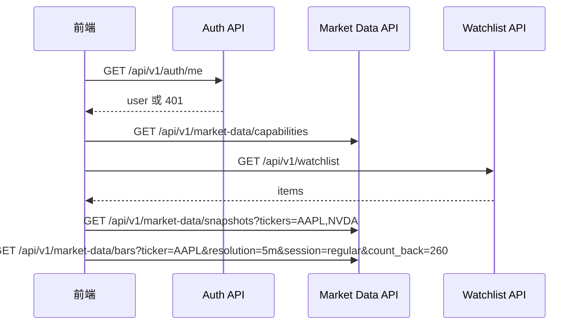
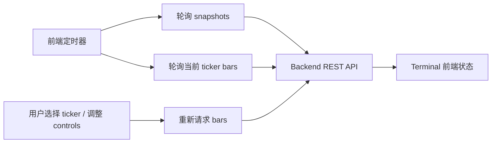
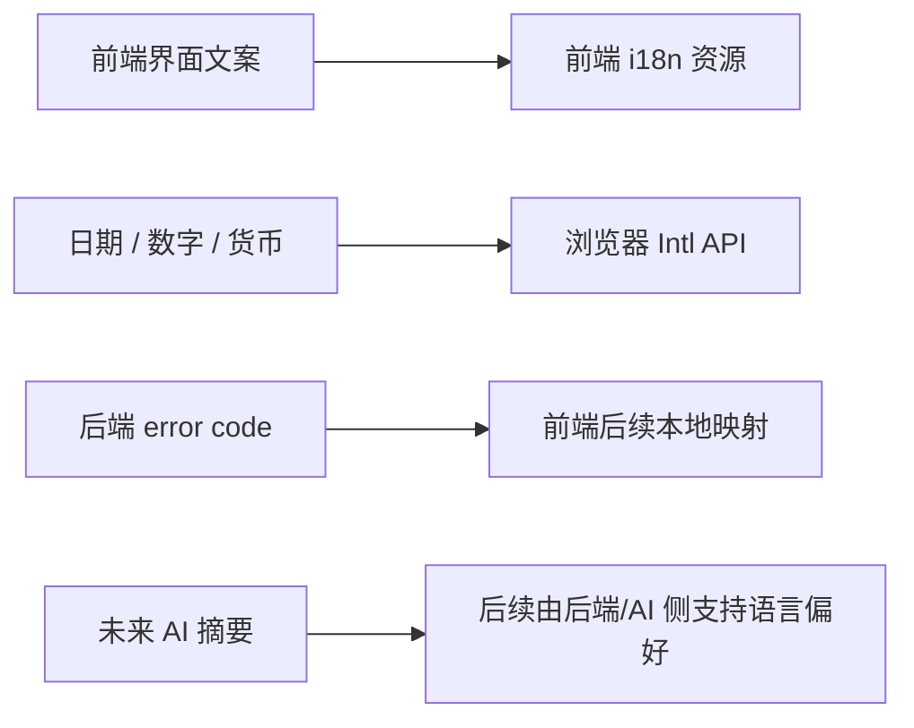
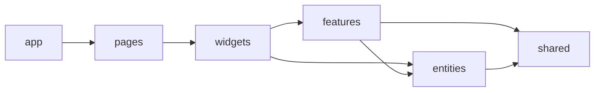

# FE-0001 - PRD001 Trade Helper 前端设计

> 状态：Completed
> 关联 PRD：`docs/prd/PRD-0001-market-watch.md`  
> 关联后端演进：`docs/backend-evolution/BE-0001-auth-watchlist.md`、`docs/backend-evolution/BE-0002-snapshots-fanout.md`、`docs/backend-evolution/BE-0003-bars-query-materialization.md`  
> 原型：
> - 首页基准：`docs/frontend-evolution/prototypes/prd001-homepage.html`
> - Terminal 原型：`docs/frontend-evolution/prototypes/prd001-terminal-prototype.html`

## 1. 概览

PRD001 的前端建设分为两个明确需求：Home page 和 terminal 建设。Home page 负责承接 Trade Helper 的产品定位；terminal 负责把 PRD001 已经具备后端接口的行情观察能力做成可用的终端工作台。

### 1.1 Home Page

Home page 是 Trade Helper 的营销首页。它需要表达产品的长期方向：用 AI 辅助交易研究，把行情数据中的机会转化为策略规则，并进一步生成回测程序，用数据验证想法是否成立。

首页不展示 PRD 阶段、后端实现细节或 i18n 方案。中英文切换只是基础界面能力，放在导航区即可，不作为产品卖点。

### 1.2 Terminal 建设

Terminal 是 PRD001 第一阶段的核心使用界面，面向真实终端用户，而不是研发调试台。它应围绕用户的行情观察与策略研究流程组织信息：维护 watchlist、查看行情快照、切换图表粒度、阅读分时/K 线、查看成交量和技术指标。

整体设计原则：

- 首页讲清楚 Trade Helper 的产品价值，不做项目进度页。
- Terminal 保持专业、高密度、适合长期盯盘的工作台气质。
- 主界面只呈现用户能理解、能据此行动的信息，例如市场时段、延迟模式、最近更新时间、价格变化、成交量和技术指标。
- 视觉上偏研究终端和策略控制台，避免券商营销风和通用 SaaS 模板。
- 前端不直连 Massive，不自行推断市场数据规则，只消费后端提供的统一 API 语义。

## 2. 产品范围

| 优先级 | 范围 | 说明 |
| --- | --- | --- |
| P0 | 鉴权 | 邮箱注册、登录、启动恢复 session、鉴权失效处理 |
| P0 | 营销首页 | 表达 Trade Helper 定位，引导注册/登录/进入终端 |
| P0 | Watchlist 基础管理 | 查询、新增、删除 ticker；默认按后端返回顺序展示；最多 50 个 |
| P0 | 行情快照 | 批量展示 watchlist snapshot；轮询刷新；展示延迟/实时模式和最近更新时间 |
| P0 | 图表基础 | 选中 ticker 后通过 REST polling 展示 bars；支持分时图、常用 resolution、session 切换 |
| P0 | 终端用户状态提示 | 对数据准备中、部分可用、降级、失败等状态做用户可理解的提示 |
| P1 | 单 watchlist 拖拽排序 | 支持用户在当前 watchlist 内拖拽调整顺序；若后端暂未提供排序持久化接口，需要先补齐接口再进入实现 |
| P1 | 技术指标显示 | 图表支持 BOLL、MA30、MA60、MA200，并区分价格/K 线区域与 volume 区域 |

### 非目标

- MVP 只跟随 PRD001 的需求和后端已经实现的接口，不扩展 PRD 外的下单、持仓、资金、订单簿等交易功能。
- 多 watchlist、分组、共享 watchlist 暂时不做。
- 前端不直连 Massive。
- 前端不复刻后端的交易日历、数据延迟、权限或行情可用性规则。
- 本期不做 Socket、WebSocket 或 SSE；所有行情更新都通过受保护 REST API polling 获取。

## 3. 信息架构



### 路由规划

| 路由 | 用途 | 主要依赖 |
| --- | --- | --- |
| `/` | Trade Helper 营销首页 | 产品定位、CTA、能力叙事 |
| `/auth` | 登录/注册入口 | Auth API |
| `/terminal` | 主工作台 | Auth session、Watchlist、Capabilities、Snapshots、Bars |
| `*` | 兜底重定向 | 有 session 去 `/terminal`，否则去 `/auth` |

## 4. 首页设计

首页不是功能说明书，而是产品定位页。第一屏需要让访问者快速理解：

- Trade Helper 是一个 AI 辅助交易研究工具。
- 它帮助用户从行情数据中发现机会，并把想法整理成可执行策略。
- 它可以根据策略生成回测程序，用历史数据验证胜率、收益风险比、回撤和稳定性。
- PRD001 的行情观察能力是产品底座，但首页不展示内部阶段或实现进度。

### 首页首屏

```text
+--------------------------------------------------------------------------+
| 顶部导航：品牌、产品能力入口、语言切换、登录/进入终端                    |
+--------------------------------------------------------------------------+
| 全屏市场研究氛围背景                                                     |
| H1: Trade Helper                                                          |
| 文案：AI 辅助交易研究、生成策略、生成回测并验证想法                       |
| CTA：开始使用 / 查看策略流程                                              |
| 产品视觉：AI strategy workbench、策略草案、回测结果                       |
+--------------------------------------------------------------------------+
| 下一段能力内容在首屏底部露出                                              |
+--------------------------------------------------------------------------+
```

首页 hero 规则：

- H1 使用品牌或产品类别，不把长价值主张塞进标题。
- Hero 背景使用全屏市场数据场景，不能是纯渐变、纯装饰 SVG 或普通左右分栏。
- 第一屏要露出下一段能力内容，避免一屏封闭。
- CTA 只承接两个动作：注册/登录、进入终端。

### 产品叙事

| 层级 | 首页表达 | 说明 |
| --- | --- | --- |
| 观察 | 从行情数据、价格结构和成交量变化中发现值得研究的机会 | 面向用户价值，不展示内部状态 |
| 生成 | 让 AI 把交易想法整理成策略规则 | 强调可审查、可修改 |
| 回测 | 根据策略生成回测程序并验证结果 | 强调用数据验证 |
| 迭代 | 根据收益、回撤、稳定性继续调整策略 | 强调辅助决策而非替代判断 |

## 5. Terminal 主布局

MVP 使用两栏工作台布局：

```text
+----------------------+---------------------------------------------------+
| 左侧栏               | 图表工作区                                        |
| watchlist 添加/删除  | 选中 ticker 概览                                 |
| snapshot 行情列表    | 分时/K 线、session、复权口径控制                  |
| 拖拽排序入口         | 价格/K 线区域 + volume 区域 + 技术指标            |
+----------------------+---------------------------------------------------+
```

### 布局规则

- 左侧栏固定承载 watchlist 操作和 snapshot 行情列表，是用户最高频入口。
- Watchlist 行内信息需要稳定对齐：ticker、价格、涨跌幅、公司名和删除按钮不能重影；公司名左对齐，长文本省略。
- Center workspace 承载选中 ticker 的概览、粒度/session/复权口径控制，以及 BOLL、MA30、MA60、MA200 等技术指标。
- 图表应接近 TradingView 的阅读习惯：上方为价格/K 线区域，下方为独立 volume 区域，技术指标覆盖在价格区。
- 延迟/实时模式只在顶部状态条表达，不在主界面重复展示 REST polling 等传输实现细节。
- Terminal 面向终端用户呈现市场观察、图表分析和策略研究所需的信息。
- 小屏幕下改为纵向流：watchlist 在上，图表和指标控制在下。

## 6. 视觉方向

| 区域 | 决策 |
| --- | --- |
| 气质 | 首页偏市场研究氛围；Terminal 偏安静、密集、可长期使用的仪表盘 |
| 色彩 | 深色底、石墨面板、红/绿行情色、琥珀警示、蓝色数据强调 |
| 字体 | ticker 与数字使用更紧凑有力量的展示字体；标签和说明使用可读性高的无衬线字体 |
| 信息密度 | 行情列表紧凑，图表区域足够大，指标控制不做营销式大卡片 |
| 动效 | 只用于刷新状态、选中行、按钮反馈；不做装饰动画 |
| 形状 | 控件圆角不超过 8px，避免漂浮卡片堆叠 |

## 7. 关键页面与状态

### 7.1 鉴权页

P0 状态：

- 登录 tab。
- 注册 tab。
- 提交中。
- 字段校验。
- 后端错误。
- token 过期后的跳转提示。

### 7.2 空 Watchlist

当 `GET /watchlist` 返回空：

- 图表工作区显示 empty state。
- 左侧栏保留添加 ticker。
- 不请求 snapshots/bars。
- 添加第一支 ticker 成功后自动选中该 ticker，并触发 snapshots + bars。

### 7.3 有数据的 Watchlist

默认行为：

- 首次进入选中第一支股票。
- 删除当前选中 ticker 后选中剩余列表第一项。
- 删除后列表为空则进入 empty state。
- Snapshot polling 基于 watchlist 全量 ticker，最多 50 个。
- 拖拽排序只作用于当前单 watchlist；多 watchlist/分组不进入本阶段。

### 7.4 Snapshot 刷新状态



UI 表达：

- `Fresh`：显示最近更新时间和正常刷新状态。
- `Partial`：缺失 ticker 保持上一值，并标记为 stale。
- `Degraded`：顶部状态条显示降级，核心列表保留最后可用数据。

### 7.5 Bars 准备状态

| 后端 `readiness` | UI 表达 |
| --- | --- |
| `pending` | 图表 loading skeleton，提示数据排队准备 |
| `initializing` | 图表 loading/empty state，提示数据准备中 |
| `ready` | 正常显示 |
| `degraded` | 显示可用 bars，同时标记降级 |
| `failed` | 图表错误态，保留 ticker header 和 controls |

## 8. API 消费模型

### 8.1 启动依赖



### 8.2 本期数据获取方式

本期前端完全依赖 backend REST API 获取行情数据，不建立 Socket、WebSocket 或 SSE 连接，也不为实时推送预留 UI 模式。用户看到的是“最近更新时间、延迟/实时模式、降级状态”等业务语义，而不是底层传输方式。



| 数据 | 触发方式 | 接口 | UI 处理 |
| --- | --- | --- | --- |
| Watchlist | 启动、增删、排序后刷新 | `GET /api/v1/watchlist` | 以后端返回为准 |
| Snapshots | 固定间隔 REST polling | `GET /api/v1/market-data/snapshots?tickers=...` | 更新列表；失败时保留 last-known-good |
| Bars | 当前 ticker 固定间隔 polling；ticker/controls 变化时立即请求 | `GET /api/v1/market-data/bars` | 根据 `readiness` 展示 loading、ready、degraded 或 failed |
| Capabilities | Terminal 启动时请求；必要时手动刷新 | `GET /api/v1/market-data/capabilities` | 展示数据模式与可用能力 |

实现约束：

- Snapshot polling 以当前 watchlist 全量 ticker 为输入，最多 50 个。
- Bars polling 只针对当前选中 ticker 和当前 controls，避免为未选中 ticker 批量拉取 bars。
- 轮询失败时先进入 degraded/last-known-good 表达，不清空已可读的行情区域。
- 如未来重新评估 Socket/SSE，需要新增独立 PRD 或 evolution 文档，不作为 FE-0001 的隐含扩展点。

### 8.3 客户端状态归属

| 状态 | 归属 | 说明 |
| --- | --- | --- |
| Access token | 前端 auth model | 初期持久化到 localStorage，并统一处理过期 |
| 当前用户 | 前端 auth model | 通过 `/auth/me` 恢复 |
| Watchlist items | 服务端状态 | 后端是数据源 |
| Watchlist 顺序 | 服务端状态优先 | 当前后端按创建顺序；拖拽排序需要后端持久化接口后再稳定落地 |
| Snapshot rows | 服务端状态 + 本地 last-known-good | 降级刷新时保留最后可用数据 |
| 当前选中 ticker | 前端 UI 状态 | 默认从 watchlist 第一项派生 |
| Resolution/session/复权口径 | 前端 UI 状态 | 作为 bars 查询参数 |
| Bars data | 服务端状态 | 后端负责 readiness/partial 语义 |
| 数据模式 | capabilities/snapshot meta | 前端只展示，不自行推断 |

## 9. 国际化设计

P0 先做前端 i18n。后端错误消息暂不翻译，仍返回稳定 `error.code` 与默认 `message`；前端暂时只负责页面文案、导航、按钮、控件标签、营销页内容、日期与数字格式化。

### 9.1 语言范围

| 优先级 | 语言 | 说明 |
| --- | --- | --- |
| P0 | `zh-CN` | 默认中文界面 |
| P0 | `en-US` | 英文界面 |

### 9.2 职责分工



### 9.3 推荐目录

```text
src/shared/i18n/
  index.ts
  locales/
    zh-CN/
      common.json
      home.json
      auth.json
      terminal.json
    en-US/
      common.json
      home.json
      auth.json
      terminal.json
```

实现建议：

- 使用 `react-i18next` 管理翻译 key 和 namespace。
- 使用浏览器 `Intl.NumberFormat` / `Intl.DateTimeFormat` 格式化价格、百分比、成交量和市场时间。
- P0 阶段把用户选择的语言持久化到 localStorage。
- 后续后端支持用户偏好后，再把 locale 同步到用户 profile。

## 10. 组件拆分

React 放置规则遵循 `frontend/AGENTS.md` 和 `react-structure`：

```text
src/
  app/
    providers/
    routes/
    styles/
  pages/
    auth/
    home/
    terminal/
  widgets/
    homepage-hero/
    capability-band/
    terminal-shell/
    watchlist-panel/
    chart-workspace/
    market-status-bar/
  features/
    auth/
    watchlist-add/
    watchlist-remove/
    watchlist-reorder/
    ticker-selection/
    snapshot-refresh/
    bars-query-controls/
  entities/
    user/
    watchlist/
    market-snapshot/
    market-bars/
    market-capabilities/
  shared/
    api/
    config/
    lib/
    ui/
```

### 10.1 依赖方向



## 11. 交互细节

### 11.1 添加 Watchlist Ticker

1. 用户输入 ticker，可以是大写或小写。
2. 前端 trim 输入，并把原始值提交给后端。
3. 后端负责校验、规范化和支持性检查。
4. 添加成功后，前端追加返回 item，并刷新 snapshots。
5. 重复、超过上限、不支持 ticker 等错误显示在添加表单旁边。

### 11.2 Watchlist 拖拽排序

- 拖拽排序只在单个默认 watchlist 内发生。
- 拖拽过程中需要保持 ticker、价格、涨跌幅、公司名、删除按钮的布局稳定，不允许重影。
- 排序完成后，如果后端已有排序接口，则提交新顺序并以服务端返回为准。
- 如果实现阶段后端尚未提供排序接口，前端不应伪造长期持久化能力；需要把排序持久化接口作为依赖补齐。

当前实现：

- 后端已通过 BE-0004 提供 `PATCH /api/v1/watchlist`，请求体为完整有序 `tickers` 数组。
- 前端通过“排序”按钮进入编辑态，拖拽只修改本地草稿顺序；点击“确认排序”后才提交完整顺序。
- 保存期间禁用添加、删除、再次排序和拖拽，避免慢响应覆盖后续用户操作。
- 排序成功后以服务端返回 `items` 覆盖本地状态；失败时回滚到确认前的 watchlist 顺序，并展示用户可理解的错误提示。

### 11.3 Ticker 选择

- 选择行后立即更新当前 ticker。
- Bars 使用已有 controls 重新请求。
- Snapshot 列表在 bars loading 时保持刷新。

### 11.4 图表粒度、时段与复权口径

- MVP 支持的控件：
  - 图表模式：`line` 表示分时图。
  - Resolution：`1m`、`5m`、`15m`、`30m`、`60m`、`1D`、`1W`、`1M`。
  - Session：`pre_market`、`regular`、`after_hours`。
  - 复权口径：默认 `split_adjusted`；以 `adjusted/raw` 作为用户可理解的切换。
- Fill 默认使用 `carry_forward`，不作为 terminal 的主控件暴露。
- 对不支持的组合，先依赖后端 `422 MARKET_BARS_UNSUPPORTED_SESSION_RESOLUTION`；接口规则稳定后，前端可提前禁用已知无效组合。

当前实现：

- 前端将 bars 查询的 `count_back` 提升到 260，用于给 MA200 留出 warm-up 数据。
- 技术指标由前端基于后端返回的 bars close 计算：BOLL 使用 20 周期均线与 2 倍标准差，MA 使用 30/60/200 周期简单移动平均。
- 图表上方价格区覆盖价格线、BOLL、MA30、MA60、MA200；下方保留独立 volume 区域。

## 12. 错误处理

| 错误码 | 展示位置 |
| --- | --- |
| `AUTH_REQUIRED`、`AUTH_TOKEN_INVALID`、`AUTH_TOKEN_EXPIRED` | 重定向到 `/auth`，保留简短原因 |
| `AUTH_INVALID_CREDENTIALS` | 鉴权表单 inline error |
| `WATCHLIST_TICKER_DUPLICATE` | 添加 ticker inline error |
| `WATCHLIST_LIMIT_EXCEEDED` | 添加 ticker inline error + 数量提示 |
| `MARKET_SNAPSHOT_UPSTREAM_UNAVAILABLE` | Terminal 状态条降级；保留 last-known-good |
| `MARKET_BARS_RANGE_INVALID` | Bars controls inline error |
| `MARKET_BARS_RANGE_TOO_LARGE` | Bars controls inline error |
| `MARKET_BARS_UNSUPPORTED_SESSION_RESOLUTION` | Controls inline error 或禁用对应组合 |

## 13. 原型说明

首页基准位于 `docs/frontend-evolution/prototypes/prd001-homepage.html`，覆盖：

- 顶部导航中的中英文切换，作为基础 UI 能力。
- 面向 Trade Helper 的营销首页。
- 全屏市场研究氛围 hero 和产品优先的 H1。
- 开始使用和查看策略流程两个 CTA。
- AI 策略生成、回测程序生成、验证结果等产品视觉。
- 机会发现、策略生成、回测验证的能力区块。
- 中英文产品文案和产品视觉标签。
- 不把 i18n 当作首页功能点或 CTA。

Terminal 原型位于 `docs/frontend-evolution/prototypes/prd001-terminal-prototype.html`，覆盖：

- 登录后的 terminal 工作台。
- Watchlist 添加、删除、选择和单列表拖拽排序的布局预留。
- Snapshot 行情列表与涨跌幅颜色表达。
- 分时图、resolution、session、复权口径控制。
- 接近 TradingView 的图表布局：上方价格/K 线区域，下方 volume 区域，支持 BOLL、MA30、MA60、MA200。
- 以终端用户可理解的市场状态和图表信息为主。
- 桌面和移动端响应式布局。

原型是静态 HTML，不调用后端 API。它们用于在 React/Vite 实现前继续打磨布局、信息密度、状态命名和视觉语言。

## 14. 实施下一步

1. P0：按 `frontend/AGENTS.md` 初始化 `frontend/` 为 React + TypeScript + Vite，并建立分层目录。
2. P0：加入 `zh-CN` / `en-US` 前端 i18n 基础。
3. P0：实现 `/` 首页，使用 Trade Helper 产品定位和 CTA 路由。
4. P0：实现路由、auth session 恢复、API client 和后端错误码归一化。
5. P0：实现 `/auth` 和 `/terminal` shell，以当前原型作为视觉基准。
6. P0：接入 watchlist 增删查和 snapshots polling，并实现 last-known-good 行为。
7. P0：接入 bars 查询控件、当前 ticker bars polling 和图表渲染，图表分为价格/K 线区域与 volume 区域。
8. P1：在后端排序持久化接口明确后，实现单 watchlist 拖拽排序。
9. P1：补充首页 CTA、语言切换、auth redirect、empty watchlist、add/delete ticker、degraded snapshot refresh、bars readiness 等 UI 测试。
